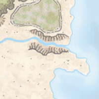
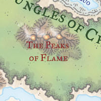
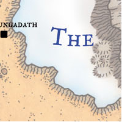

# 

A hobby project to create a vector map of Faerun (possibly extended to Toril) during the D&D 3.5e (~1376 DR).
My approach is to approximate the iconic drawing style of the [official 2001 map](http://web.archive.org/web/20160816135344/http://archive.wizards.com/dnd/images/wd_maps/FRposterLarge_150.jpg) using a combination of svg path generation scripts and filters and then apply them on an svg map, containing only the outlines of geographic regions.

Ideally this should have the following benefits:
* Simple Editing: Changing existing features of the map or adding new ones can be done in an SVG editor.
* High Quality Zoom: SVG enables creation of detail maps without getting pixelated results.
* Merging of Different Sources: Detail maps of specific maps exist and the vector format should aid in the combination of different map sources.
* GeoJson, TopoJson output: Vector data can be used in online map interfaces like [Open Layers](https://openlayers.org/)

## Forgotten Realms Map Styles

The first step is to recreate the drawing style of various map regions in svg format. A side objective here is to be efficient and use filters rather than geometry wherever possible. 

Major region types include:
* Ocean/Continental Shelf

  Color gradient from light to darker blue with three plateaus based on distance, blue coastline.

  

* Plain Land

  Minor color variation between two light brown tones with dark brown dots randomly placed in the area.

  

* Grasslands

  Light green filter placed over plain land.

  

* Forests/Jungles

  Brown winding outline followed by dark green band with many dot sprinkles. Filled with two varying light green tones and more sparse dots. (Jungle and forest use slightly different greens)

  

  

* Sandy/Rocky Deserts

  Sharp color boundary, but very sparse outline reinforced by a narrow band of dots. Filled with dandom groups of dots of varying sizes. (Sandy/Rocky denoted by different yellow/brown tones)

  

  

* Barrens/Badlands

  Double outline with many breaks, otherwise similar to rocky desert with additional smalls hill markers.

  

* Hills

  Round brown shapes with some shading to give a 3D impression, with radial lines along the flanks.

  

* Cliffs

  Narrow brown bands with a strong cliff line on one side and slightly distorted lines down the flank.

  

* Marsh/Swamp

  

  

* Moor

  

* Mountains/High Mountains/Volcanos

  Brown area with a ridge line splitting it into two sides of shading. The darker side has continuous flank lines, while the brighter one has sparse short lines near the ridge and outlines.
  High mountains have white shading close to the ridge.

  

  

  

* Glaciers/Ice

  

* Rivers/Lakes

  

